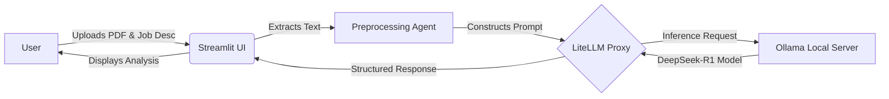

Here is the full, ready-to-use `README.md`. You can copy the code block below directly into your file.

```markdown
# 📄 AI Agent Resume Matcher


## 📖 Description
The **AI Agent Resume Matcher** is an intelligent tool designed to bridge the gap between job seekers and recruiters. It analyzes a candidate's CV (PDF) against a specific job description to determine compatibility.

Unlike cloud-based solutions, this project runs **entirely locally** using **Ollama** and the **DeepSeek-R1** model. This ensures that sensitive personal data (resumes) never leaves your machine, providing maximum privacy and zero latency.

## ✨ Key Features
- **🔒 Privacy First:** Runs locally on your hardware; no data is sent to OpenAI or cloud providers.
- **📄 PDF Support:** Automatically parses and extracts text from PDF resumes.
- **🤖 Deep Analysis:** Uses `deepseek-r1:1.5b` to understand context, skills, and seniority.
- **📊 Matching Score:** Provides a compatibility score (0-100%) and actionable feedback.
- **💻 Interactive UI:** Built with Streamlit for an easy-to-use web interface.

## 🏗️ Architecture / How It Works
The system follows a Retrieval-Augmented Generation (RAG) style workflow specifically tuned for comparison tasks.



1. **Ingestion:** The app reads the PDF and the job description text.
2. **Orchestration:** `LiteLLM` acts as a bridge to format the prompt correctly for the local model.
3. **Inference:** The **DeepSeek-R1** model processes the inputs to identify gaps in skills and experience.
4. **Output:** The Streamlit UI renders the results in a clean dashboard.

## 🚀 Installation

### Prerequisites

* **Python 3.8+**
* **[Ollama](https://ollama.com/)** (Must be installed and running)

### 1. Clone the Repository

```bash
git clone [https://github.com/A-Khadija/AI-Agent-Resume.git](https://github.com/A-Khadija/AI-Agent-Resume.git)
cd AI-Agent-Resume

```

### 2. Set up Virtual Environment

It is recommended to use Conda or venv to manage dependencies.

```bash
conda create -n LLM2 python=3.10
conda activate LLM2

```

### 3. Install Dependencies

```bash
pip install -r requirements.txt
pip install litellm

```

### 4. Pull the Local Model

This project uses the `deepseek-r1:1.5b` model. You must pull it via Ollama before running the app.

```bash
ollama pull deepseek-r1:1.5b

```

## 🎮 Usage

### Option 1: Web Interface (Streamlit)

To launch the visual dashboard:

**Linux/Mac:**

```bash
export PYTHONPATH=.
streamlit run src/app.py

```

**Windows (CMD):**

```cmd
set PYTHONPATH=.
streamlit run src/app.py

```

*The application will open automatically at `http://localhost:8501*`

### Option 2: Command Line (CLI)

To run the agent directly in your terminal:

```bash
python -m src.main

```

## 📂 Project Structure

```bash
AI-Agent-Resume/
├── data/                  # Directory for storing sample CVs
├── src/                   # Source code directory
│   ├── app.py             # Main Streamlit application
│   ├── main.py            # CLI entry point
│   └── utils.py           # Helper functions (PDF parsing, etc.)
├── requirements.txt       # Python dependencies
└── README.md              # Project documentation

```

## 🛠️ Tech Stack

* **Language:** Python
* **Interface:** Streamlit
* **LLM Orchestration:** LiteLLM
* **Local Inference:** Ollama
* **Model:** DeepSeek-R1:1.5b

## 🤝 Contributing

Contributions are always welcome!

1. Fork the repository.
2. Create a new branch (`git checkout -b feature/NewFeature`).
3. Commit your changes.
4. Push to the branch and open a Pull Request.

## 📝 License

This project is licensed under the [MIT License](https://www.google.com/search?q=LICENSE).
